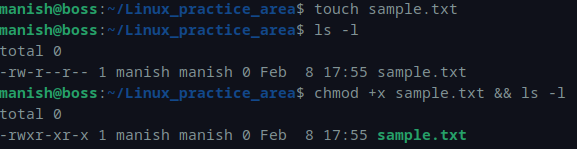
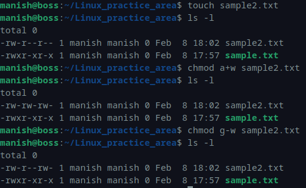
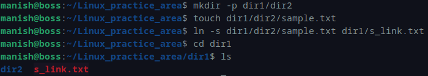
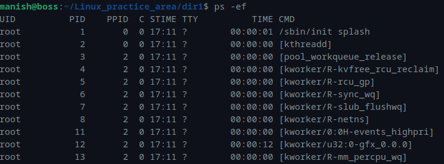
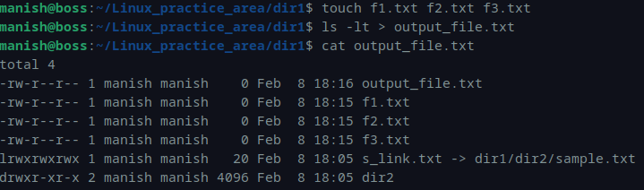

# Module 1 – Linux Assessment

---

## Q1. Create a file and add executable permission to all users (user, group, others)

### Command
```bash
touch sample.txt
ls -l
chmod +x sample.txt
ls -l
```

### Output
```bash
-rw-r--r-- 1 manish manish 0 Feb  8 17:55 sample.txt
-rwxr-xr-x 1 manish manish 0 Feb  8 17:55 sample.txt
```

### Screenshot


---

## Q2. Create a file and remove write permission for group user alone

### Command
```bash
touch sample2.txt
ls -l
chmod a+w sample2.txt
ls -l
chmod g-w sample2.txt
ls -l
```

### Output
```bash
-rw-r--r-- 1 manish manish 0 Feb  8 18:02 sample2.txt
-rw-rw-rw- 1 manish manish 0 Feb  8 18:02 sample2.txt
-rw-r--rw- 1 manish manish 0 Feb  8 18:02 sample2.txt
```

### Screenshot


---

## Q3. Create a file and add a soft link to the file in a different directory

### Command
```bash
mkdir -p dir1/dir2
touch dir1/dir2/sample.txt
ln -s dir1/dir2/sample.txt dir1/s_link.txt
cd dir1
ls
```

### Output
```bash
dir2  s_link.txt
```

### Screenshot


---

## Q4. Use ps command with options to display all active processes

### Command
```bash
ps -ef
```

### Output (Partial)
```bash
UID        PID  PPID  C STIME TTY          TIME CMD
root         1     0  0 17:11 ?        00:00:01 /sbin/init splash
...
manish    7090  4545 99 18:13 pts/1    00:00:00 ps -ef
```

### Screenshot


---

## Q5. Create 3 files and redirect sorted output by timestamp to a file

### Command
```bash
touch f1.txt f2.txt f3.txt
ls -lt > output_file.txt
cat output_file.txt
```

### Output
```bash
-rw-r--r-- 1 manish manish    0 Feb  8 18:16 output_file.txt
-rw-r--r-- 1 manish manish    0 Feb  8 18:15 f1.txt
-rw-r--r-- 1 manish manish    0 Feb  8 18:15 f2.txt
-rw-r--r-- 1 manish manish    0 Feb  8 18:15 f3.txt
lrwxrwxrwx 1 manish manish   20 Feb  8 18:05 s_link.txt -> dir1/dir2/sample.txt
drwxr-xr-x 2 manish manish 4096 Feb  8 18:05 dir2
```

### Screenshot


---
