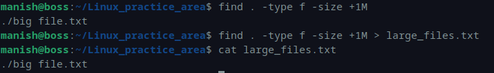
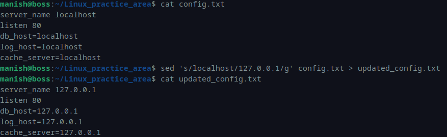
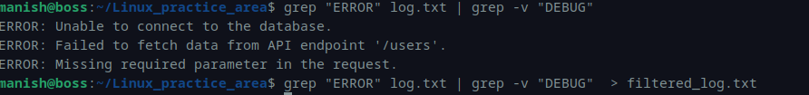
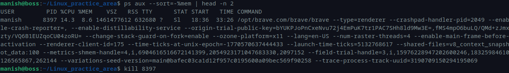
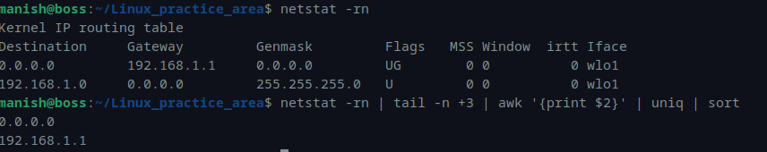

# Module 2 – Linux Assessment

---

## Q1. List all files larger than 1MB and save output to a file

### Command
```bash
find . -type f -size +1M
find . -type f -size +1M > large_files.txt
cat large_files.txt
```

### Output
```bash
./big file.txt
```

### Screenshot


---

## Q2. Replace all occurrences of "localhost" with "127.0.0.1"

### Command
```bash
cat config.txt
sed 's/localhost/127.0.0.1/g' config.txt > updated_config.txt
cat updated_config.txt
```

### Output
```bash
server_name 127.0.0.1
listen 80
db_host=127.0.0.1
log_host=127.0.0.1
cache_server=127.0.0.1
```

### Screenshot


---

## Q3. Search for lines containing "ERROR" but exclude "DEBUG"

### Command
```bash
grep "ERROR" log.txt | grep -v "DEBUG"
grep "ERROR" log.txt | grep -v "DEBUG" > filtered_log.txt
```

### Output
```bash
ERROR: Unable to connect to the database.
ERROR: Failed to fetch data from API endpoint '/users'.
ERROR: Missing required parameter in the request.
```

### Screenshot


---

## Q4. Identify the process with highest memory usage and terminate it

### Command
```bash
ps aux --sort=-%mem | head -n 2
kill 8397
```

### Output (Partial)
```bash
USER   PID  %CPU %MEM COMMAND
manish 8397 14.3  8.6  /opt/brave.com/brave/brave ...
```

### Screenshot


---

## Q5. Print all available gateways in sorted order

### Command
```bash
netstat -rn
netstat -rn | tail -n +3 | awk '{print $2}' | uniq | sort
```

### Output
```bash
0.0.0.0
192.168.1.1
```

### Screenshot


---
