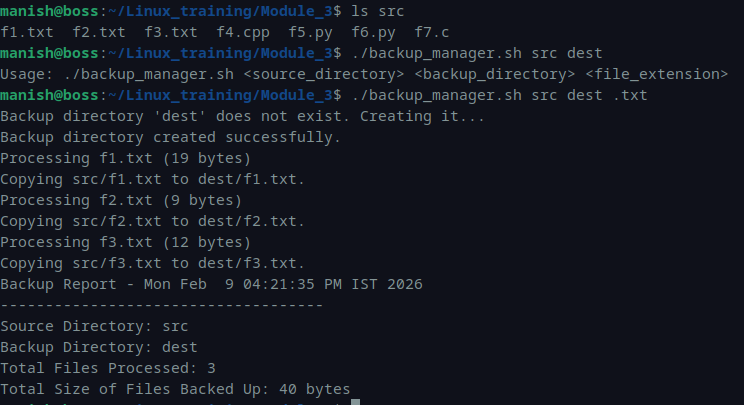

# Module 3 – Linux Assessment  
## Automating File Backup using Shell Script

---

## Script: `backup_manager.sh`

### Description
This script automates file backup from a source directory to a destination directory based on file extension.

It performs:

- Argument validation
- Directory existence checks
- Automatic backup directory creation
- File filtering using globbing
- Timestamp comparison before overwrite
- File count and total size tracking
- Backup report generation

---

## Script Code

```bash
#!/bin/bash

# Validate number of arguments
if [ $# -ne 3 ]; then
    echo "Usage: $0 <source_directory> <backup_directory> <file_extension>"
    exit 1
fi

SOURCE_DIR="$1"
BACKUP_DIR="$2"
FILE_EXT="$3"

if [ ! -d "$SOURCE_DIR" ]; then
    echo "Error: Source directory '$SOURCE_DIR' does not exist."
    exit 1
fi

if [ ! -d "$BACKUP_DIR" ]; then
    echo "Backup directory '$BACKUP_DIR' does not exist. Creating it..."
    mkdir -p "$BACKUP_DIR"
    sleep 2
    echo "Backup directory created successfully."
fi

FILES=("$SOURCE_DIR"/*"$FILE_EXT")

if [ ${#FILES[@]} -eq 0 ] || [ ! -e "${FILES[0]}" ]; then
    echo "No files with extension '$FILE_EXT' found in '$SOURCE_DIR'."
    exit 0
fi

export FILE_COUNT=0
TOTAL_SIZE=0

for FILE in "${FILES[@]}"; do
    
    FILE_SIZE=$(stat -c %s "$FILE")
    echo "Processing $(basename "$FILE") ($FILE_SIZE bytes)"
    
    DEST_FILE="$BACKUP_DIR/$(basename "$FILE")"
    
    if [ -e "$DEST_FILE" ]; then
        if [ "$FILE" -nt "$DEST_FILE" ]; then
            echo "Updating $DEST_FILE (newer source file)."
            cp --preserve=all "$FILE" "$DEST_FILE"
        else
            echo "Skipping $DEST_FILE (already up-to-date)."
            continue
        fi
    else
        echo "Copying $FILE to $DEST_FILE."
        cp --preserve=all "$FILE" "$DEST_FILE"
    fi

    FILE_COUNT=$((FILE_COUNT + 1))
    TOTAL_SIZE=$((TOTAL_SIZE + FILE_SIZE))
done

REPORT_FILE="$BACKUP_DIR/backup_report.log"

{
    echo "Backup Report - $(date)"
    echo "------------------------------------"
    echo "Source Directory: $SOURCE_DIR"
    echo "Backup Directory: $BACKUP_DIR"
    echo "Total Files Processed: $FILE_COUNT"
    echo "Total Size of Files Backed Up: $TOTAL_SIZE bytes"
} > "$REPORT_FILE"

cat "$REPORT_FILE"

exit 0
```

---

## Execution

### Listing Source Directory
```bash
ls src
```

### Running Script (Invalid Arguments)
```bash
./backup_manager.sh src dest
```

### Output
```bash
Usage: ./backup_manager.sh <source_directory> <backup_directory> <file_extension>
```

### Running Script (Correct Usage)
```bash
./backup_manager.sh src dest .txt
```

### Output
```bash
Backup directory 'dest' does not exist. Creating it...
Backup directory created successfully.
Processing f1.txt (19 bytes)
Copying src/f1.txt to dest/f1.txt.
Processing f2.txt (9 bytes)
Copying src/f2.txt to dest/f2.txt.
Processing f3.txt (12 bytes)
Copying src/f3.txt to dest/f3.txt.
Backup Report - Mon Feb  9 04:21:35 PM IST 2026
------------------------------------
Source Directory: src
Backup Directory: dest
Total Files Processed: 3
Total Size of Files Backed Up: 40 bytes
```

---

## Screenshot



---
