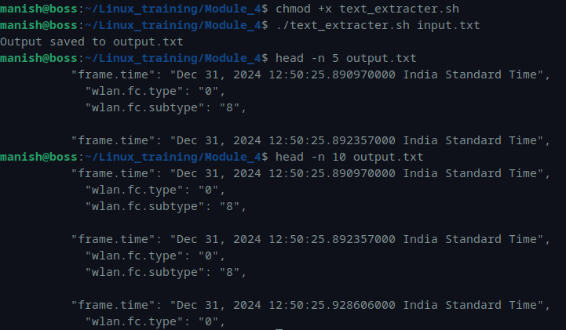

# Module 4 – Linux Assessment  
## Text Extraction Using Shell Script

---

## Script: `text_extracter.sh`

### Description
This script reads an input file line by line and extracts the following fields:

- `"frame.time"`
- `"wlan.fc.type"`
- `"wlan.fc.subtype"`

The extracted content is written to `output.txt`.

---

## Script Code

```bash
#!/bin/bash

# Check number of command line arguments
if [ "$#" -ne 1 ]; then
    echo "Input File Not Given"
    exit 1
fi

input="$1"
output="output.txt"

# Clear output file
> "$output"

# Read file line by line
while IFS= read -r line; do

    if [[ "$line" == *"\"frame.time\""* ]]; then
        echo "$line" >> "$output"

    elif [[ "$line" == *"\"wlan.fc.type\""* ]]; then
        echo "$line" >> "$output"

    elif [[ "$line" == *"\"wlan.fc.subtype\""* ]]; then
        echo "$line" >> "$output"
        echo "" >> "$output"
    fi

done < "$input"

echo "Output saved to $output"
```

---

## Execution

### Step 1 – Give Execute Permission
```bash
chmod +x text_extracter.sh
```

### Step 2 – Run Script
```bash
./text_extracter.sh input.txt
```

### Output
```bash
Output saved to output.txt
```

---

## Sample Extracted Output

```bash
"frame.time": "Dec 31, 2024 12:50:25.890970000 India Standard Time",
"wlan.fc.type": "0",
"wlan.fc.subtype": "8",

"frame.time": "Dec 31, 2024 12:50:25.892357000 India Standard Time",
"wlan.fc.type": "0",
"wlan.fc.subtype": "8",
```

---

## Error Handling (errors.log)

```bash
[ERROR] :No Matching Keywords found:(
[ERROR] :Key Shouldnot be Empty --help make use of help to see the details
```

---

## Screenshot



---
