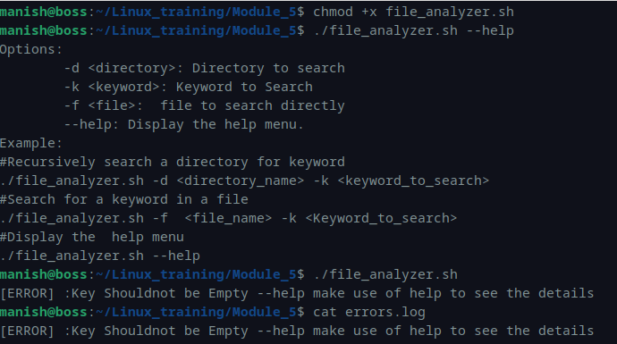
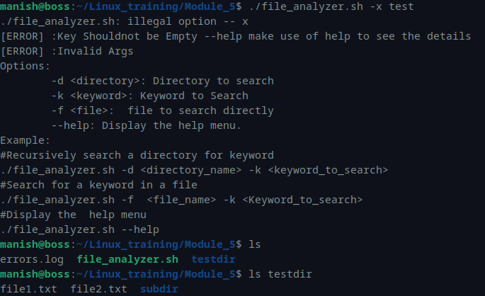
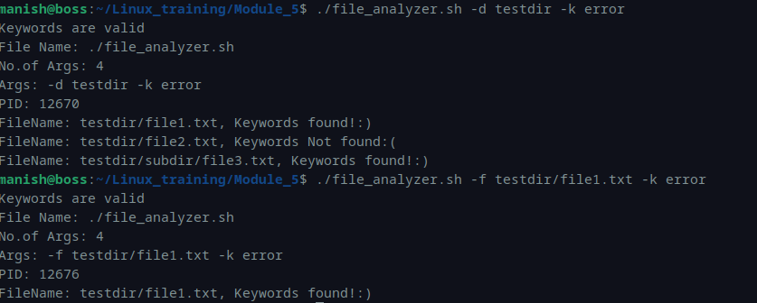

# Module 5 – Linux Assessment  
## File Analyzer Script (Recursive Search & Error Handling)

---

## Script: `file_analyzer.sh`

### Description
This script demonstrates:

- Recursive directory search
- File search functionality
- Error logging using redirection
- Here document (Help menu)
- getopts for argument parsing
- Regular expression validation
- Special parameters usage ($0, $#, $@, $$)

---

## Script Code

```bash
#!/bin/bash

logFile='errors.log'

ErrorFile(){
        echo "[ERROR] :$1" >> "$logFile" && cat "$logFile"
}

Help(){
        cat << END
Options:
        -d <directory>: Directory to search
        -k <keyword>: Keyword to Search
        -f <file>:  file to search directly
        --help: Display the help menu.
Example:
./file_analyzer.sh -d <directory_name> -k <keyword_to_search>
./file_analyzer.sh -f <file_name> -k <Keyword_to_search>
./file_analyzer.sh --help
END
}

recursiveSearch(){
        local directory=$1
        local keyword=$2
        if [[ ! -d "$directory" ]]; then
                ErrorFile "Invalid Directory $directory or may be it\'s not accessible"
                return 1
        fi
        for i in "$directory"/*; do
                if [[ -d $i ]]; then
                        recursiveSearch "$i" "$keyword"
                elif [[ -f $i ]]; then
                        grep -q "$keyword" "$i"
                        if [[ $? -eq 0 ]]; then
                                echo "FileName: $i, Keywords found!:)"
                        else
                                echo "FileName: $i, Keywords Not found:("
                        fi
                fi
        done
}

fileSearch(){
        local fileName=$1
        local key=$2
        grep -q "$key" "$fileName"
        if [[ $? -eq 0 ]]; then
                echo "FileName: $fileName, Keywords found!:)"
        else
                ErrorFile "No Matching Keywords found:("
        fi
}

if [[ $1 == '--help' ]]; then
        Help
        exit 0
fi

directory=""
file=""
key=""

while getopts "d:f:k:" args; do
        case "$args" in
                d) directory="$OPTARG" ;;
                f) file="$OPTARG" ;;
                k) key="$OPTARG" ;;
                ?) ErrorFile "Invalid Args"; Help; exit 1 ;;
        esac
done

if [[ -z "$key" ]]; then
        ErrorFile "Key Shouldnot be Empty --help make use of help to see the details"
        exit 1
fi

if echo "$key" | grep -Eq '^[a-zA-Z0-9._ @-]+$'; then
        echo "Keywords are valid"
else
        ErrorFile "KeyWords are invalid"
        exit 1
fi

# Special Parameters
echo "File Name: $0"
echo "No.of Args: $#"
echo "Args: $@"
echo "PID: $$"

if [[ -n "$directory" ]]; then
        recursiveSearch "$directory" "$key"
elif [[ -n "$file" ]]; then
        fileSearch "$file" "$key"
else
        ErrorFile "No target specified. Please provide -d or -f."
        Help
        exit 1
fi

exit 0
```

---

## Execution Examples

### 1. Display Help Menu

```bash
./file_analyzer.sh --help
```

### Screenshot


---

### 2. No Arguments (Error Case)

```bash
./file_analyzer.sh
```

### Output
```bash
[ERROR] :Key Shouldnot be Empty --help make use of help to see the details
```

### Screenshot


---

### 3. Invalid Option

```bash
./file_analyzer.sh -x test
```

### Output
```bash
[ERROR] :Invalid Args
```

---

### 4. Recursive Directory Search

```bash
./file_analyzer.sh -d testdir -k error
```

### Output
```bash
Keywords are valid
File Name: ./file_analyzer.sh
No.of Args: 4
Args: -d testdir -k error
PID: 12670
FileName: testdir/file1.txt, Keywords found!:)
FileName: testdir/file2.txt, Keywords Not found:(
FileName: testdir/subdir/file3.txt, Keywords found!:)
```

### Screenshot


---

### 5. Search in Specific File

```bash
./file_analyzer.sh -f testdir/file1.txt -k error
```

### Output
```bash
FileName: testdir/file1.txt, Keywords found!:)
```

---

## Error Log (errors.log)

```bash
[ERROR] :Key Shouldnot be Empty --help make use of help to see the details
[ERROR] :Invalid Args
```

---
